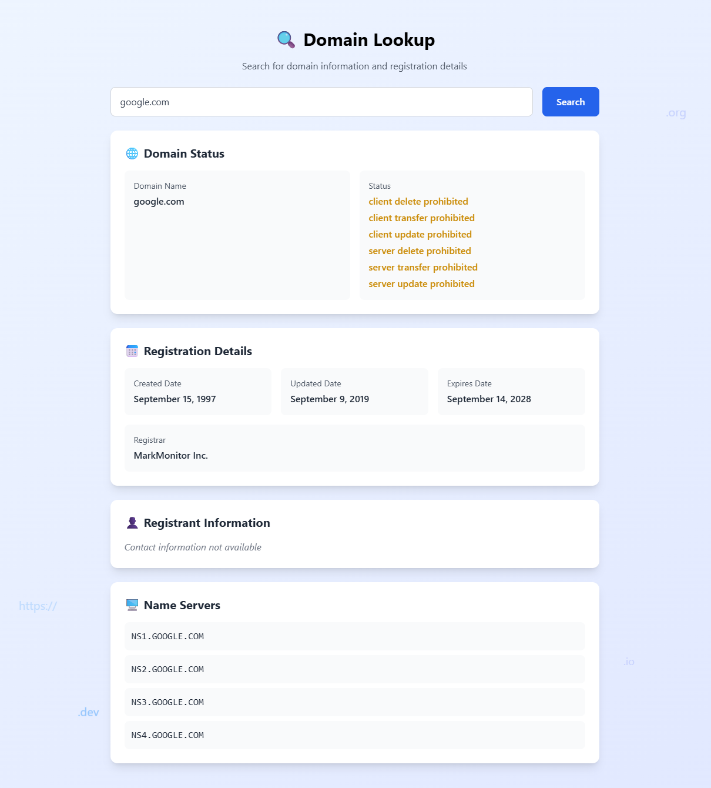

# 🔍 Domain Lookup App

A simple and visually appealing web app that allows users to search for domain registration information using a free domain lookup API.

---

## 📚 Table of Contents

- [Features](#features)
- [Tech Stack](#tech-stack)
- [Project Structure](#project-structure)
- [Setup Instructions](#setup-instructions)
- [How It Works](#how-it-works)
- [Preview](#preview)
- [Notes](#notes)

---

## ✨ Features

- Validate and lookup any valid domain (e.g., `example.com`)
- Displays domain status and registration information
- Shows creation, update, and expiration dates
- Displays registrar information
- Shows name servers
- Displays registrant contact information when provided by the API
- Handles cases where registrant information is unavailable due to domain privacy
- Includes an animated background and clean Tailwind-styled UI
- Responsive design for desktop and mobile
- Error handling for invalid domains and failed API requests
- Uses a Node.js/Express backend to handle API requests

---

## 🧰 Tech Stack

- **Frontend:** React, Tailwind CSS
- **Backend:** Node.js, Express
- **API:** Domainee Domain Lookup API
- **Bundler:** Parcel

---

## 🗂️ Project Structure

```text
domain-lookup-app/

├── frontend/
│   ├── public/
│   │   ├── index.html
│   ├── src/
│   │   ├── App.js
│   │   ├── index.css
│   │   └── index.js
│   └── package.json
│
├── backend/
│   ├── server.js
│   └── package.json
│
├── .gitignore
└── README.md
```

---

## ⚙️ Setup Instructions

### 1. Clone the repository

```bash
git clone https://github.com/Kira-Saints/domain-lookup-app.git
cd domain-lookup-app
```

### 2. Install dependencies

Install the backend dependencies:

```bash
cd backend
npm install
```

Install the frontend dependencies:

```bash
cd ../frontend
npm install
```

### 3. Run the backend

Open a terminal in the `backend` directory and run:

```bash
npm start
```

The backend will run on:

```text
http://localhost:5000
```

### 4. Run the frontend

Open another terminal in the `frontend` directory and run:

```bash
npm start
```

The frontend will run on the port configured by the Parcel setup, usually:

```text
http://localhost:3000
```

### 5. Open the application

Open your browser and visit:

```text
http://localhost:3000
```

Enter a domain such as:

```text
google.com
brilliant.org
github.com
```

and click **Search** to retrieve the available domain information.

---

## 🔄 How It Works

The application uses a React frontend and an Express backend.

```text
User enters domain
        ↓
React Frontend
        ↓
Express Backend
        ↓
Domainee API
        ↓
Domain Information
        ↓
Express Backend
        ↓
React Frontend
```

The backend acts as an API layer between the frontend and the external domain lookup service. This keeps the external API integration on the server side and allows the frontend to work with a consistent response structure.

---

## 🖼️ Preview



---

## 📝 Notes

- The application supports valid domains across supported TLDs and is not limited to `.com` domains.
- Available domain information depends on the registry and the information provided by the external API.
- Registrant contact information may not be available because domain registration data can be privacy-protected or redacted.
- The project uses a free domain lookup API and does not require a WhoisXML API key.
- CORS must be properly configured if the frontend and backend are deployed separately.
- This project is intended for educational and portfolio demonstration purposes.

---

© 2025 Kira Saints. All rights reserved.